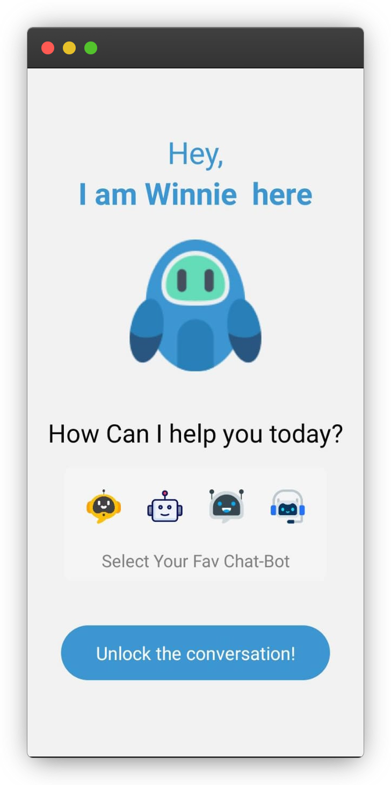
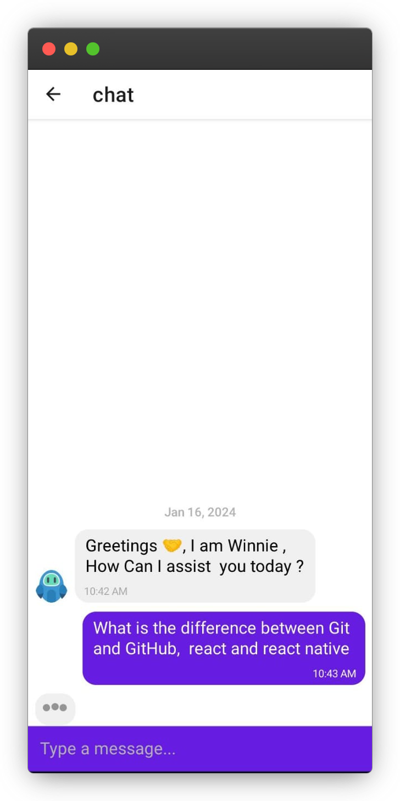

# ChatFlowPro - React Native Expo App

ChatFlowPro is a lightweight React Native Expo app that simplifies communication with the Google Assistant. It relies on a Next.js API for fetching replies, providing a straightforward interface with two screens and a typing animation during responses.

## Technologies Used

- **@react-navigation/native**: A navigation library for React Native.

- **@react-navigation/native-stack** : A stack navigator for React Navigation.

- **axios** : A promise-based HTTP client for fetching data.

- **expo** ): The Expo framework for developing React Native applications.

- **expo-status-bar** : A component to manage the status bar appearance in Expo projects.

- **react** (18.2.0): The core React library.

- **react-native** : The core React Native library.

- **react-native-gifted-chat** : A library for creating chat interfaces in React Native.

- **react-native-safe-area-context** : A library for handling safe areas in React Native.

- **react-native-screens** : A library for managing native views in React Native.

## Screenshots

  
  

## Getting Started

### Prerequisites

- [Node.js](https://nodejs.org/) installed.
- Install Expo CLI globally: `npm install -g expo-cli`.

### Installation

1. Clone the repository: `git clone https://github.com/ZeeshanMukhtar1/ChatFlowPro.git`
2. Navigate to the project directory: `cd ChatFlowPro`
3. Install dependencies: `npm install`

### Running the App

- Use Expo CLI to run the app: `expo start`
- Follow the instructions in the console to open the app on an emulator or physical device.

## Usage

1. Select an assistant bot.
2. Engage in a chat with the Google Assistant.
3. Experience a typing animation during responses.

## Support and Feedback

For issues or feedback, please [open an issue](https://github.com/ZeeshanMukhtar1/ChatFlowPro/issues).

## Contributing

Contributions are welcome! please feel free to submit a [Pull Request](https://github.com/ZeeshanMukhtar1/ChatFlowPro/pulls)

---

**ChatFlowPro - Streamlining Conversations with Google Assistant**
